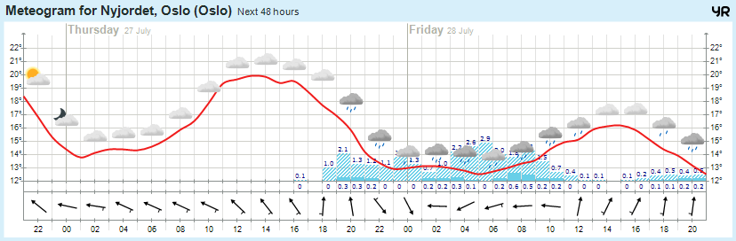

# MagicMirror² Module: YR Meteogram
'MMM-YrMeteogram' is a module for displaying a [meteogram](https://en.wikipedia.org/wiki/Meteogram) (48 hours) for any location in **Norway only**. 

 

Current version is 1.0.0. See [changelog](CHANGELOG.md "Version history") for version history.

## Installation

Remote to your Raspberry Pi and clone the repository:

````bash
cd ~/MagicMirror/modules
git clone https://github.com/CatoAntonsen/MMM-YrMeteogram.git
````

Add the module to the modules array in the `config/config.js` file by adding the following section:
```
{
	module: 'MMM-YrMeteogram',
	position: 'bottom_right',
	config: {
		zip: 1270
	}
},
```

## Configuration options

These are the valid configuration options:

### **zip**
The location you want the meteogram for is given by (almost) any zip-code (postkode) in Norway. If it doesn't work with yours, try another one.
Default is `1270` (which happens to be mine...)

### **refreshInterval**
How often you want the meteogram to update. Try to not refresh too often since it doesn't make sence.
Default is `60000` which is every 10 minutes.

### **debug**
Show messages in the log if set to `true`. Default is `false`.

## Update

To update MMM-YrMeteogram, go to the MMM-YrMeteogram folder:
````bash
cd ~/MagicMirror/modules/MMM-YrMeteogram
git pull
pm2 restart mm
````

## Credits

- Meteogram is made by [Yr](https://yr.no). Thanks to them!

Good luck!
